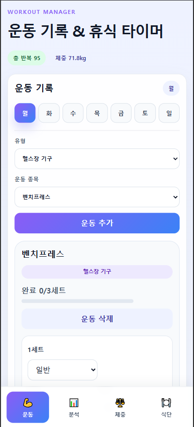
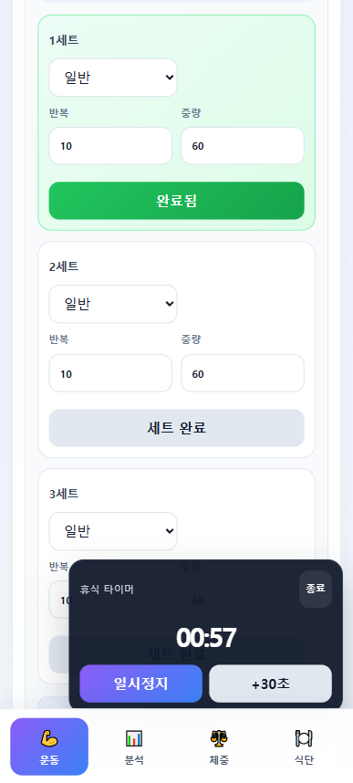
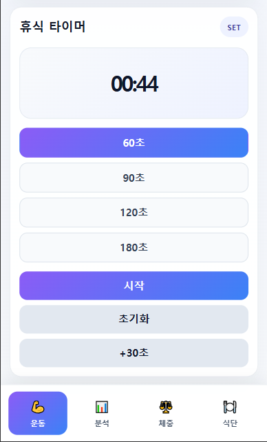
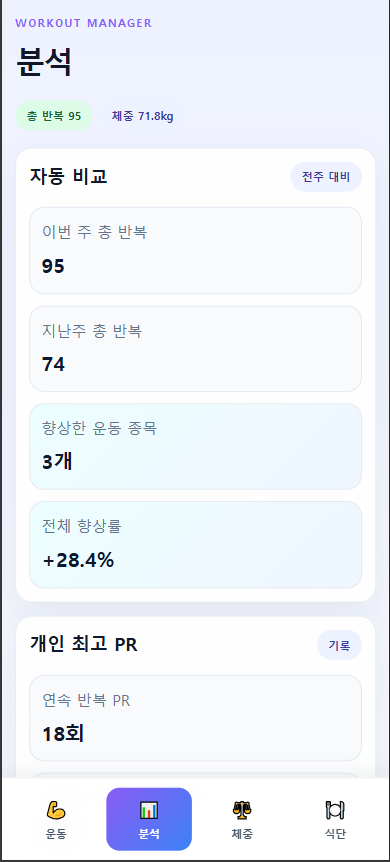
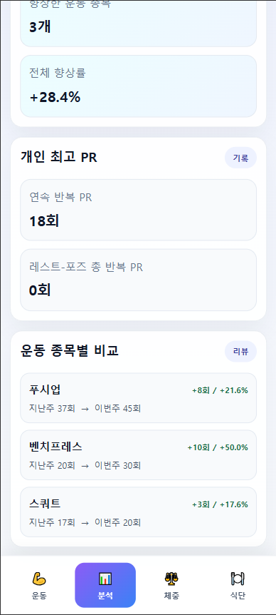
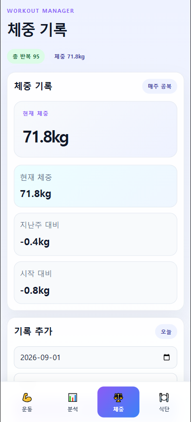
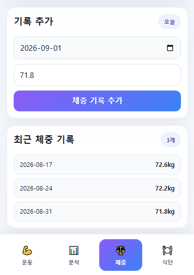
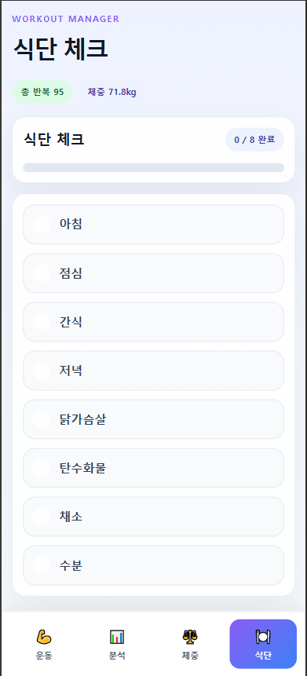

# 바이브코딩 해커톤 - 팀 발표

## 1. 팀명 / 팀원

- **팀명:** 06_beomjun
- **팀원 (2명):** 최승범, 김영준

## 2. 한 줄 소개

> 운동 중 세트와 반복 횟수를 실시간으로 기록하고, 휴식 타이머와 운동 기록 비교까지 한 번에 관리할 수 있는 개인 운동관리 웹앱입니다.

## 3. 선정 이유 / 해결하려 한 문제

> 운동에 집중하다 보면 현재 몇 세트째인지, 한 세트에서 몇 회를 수행했는지 헷갈리는 경우가 있습니다. 또한 세트 사이의 휴식시간을 지키기 위해 별도로 휴대폰 타이머를 실행해야 하는 불편함이 있었습니다. 이러한 문제를 해결하기 위해 운동 기록과 휴식 타이머를 하나의 웹앱에서 사용할 수 있도록 기획했습니다.

## 4. 핵심 기능

- **기능 1: 세트 단위 실시간 운동 기록**  
  운동 종목별로 세트 수, 반복 횟수, 중량을 기록하고 각 세트의 완료 여부를 확인할 수 있습니다.

- **기능 2: 휴식 타이머 연동**  
  한 세트를 완료하면 휴식 타이머를 바로 사용할 수 있어 운동 기록과 휴식시간 관리를 한 화면에서 이어서 할 수 있습니다.

- **기능 3: 이전 기록과 자동 비교**  
  이전 운동 기록과 현재 기록을 비교하여 총 반복 수, 향상 정도, 향상률 및 개인 최고 기록(PR)을 확인할 수 있습니다.

- **보조 기능: 체중 및 식단 관리**  
  공복 체중을 기록하고 아침, 점심, 간식, 저녁, 닭가슴살, 탄수화물, 채소, 수분 섭취 여부를 체크할 수 있습니다.

## 5. 사용 기술 스택

- **Frontend:** React
- **Language:** JavaScript
- **Styling:** CSS
- **Build Tool / Dev Server:** Vite
- **State Management:** React `useState`, `useEffect`
- **Data Storage:** Browser LocalStorage
- **Timer:** JavaScript Timer API (`setInterval`, `clearInterval`)
- **Development Environment:** Visual Studio Code
- **Version Control:** Git / GitHub
- **AI Coding Assistant:** GitHub Copilot

## 6. AI 활용 포인트

- 아이디어를 실제 React 웹앱 구조로 빠르게 구현하는 데 GitHub Copilot을 활용했습니다.
- 반복되는 React 컴포넌트와 CSS 작성 및 코드 리팩터링에 AI를 활용했습니다.
- 운동 기록, 세트 완료, 휴식 타이머 등 핵심 기능 구현 과정에서 AI에게 요구사항을 구체적인 프롬프트로 전달하고 결과를 테스트하며 수정했습니다.
- 모바일에서도 편리하게 사용할 수 있도록 반응형 UI/UX 개선 아이디어와 코드 작성에 AI를 활용했습니다.
- 단순히 AI가 생성한 코드를 사용하는 것이 아니라, 실제 사용 목적에 맞는지 직접 확인하고 문제점을 다시 프롬프트로 전달하는 방식으로 반복 개선했습니다.

## 7. 저장소 링크

- **GitHub:** [(https://github.com/kh-thejoeun-hackathon/06_beomjun.git)]

## 8. 데모 화면

발표에서는 다음 순서로 시연합니다.

## 9. 소감 한 마디

> 짧은 시간이었지만 AI와 함께하니 아이디어를 빠르게 결과물로 만들 수 있어 즐거웠습니다. 특히 단순히 코드를 생성하는 것에서 끝나는 것이 아니라, 직접 사용해 보면서 불편한 점을 찾고 AI와 반복적으로 개선하는 과정에서 바이브코딩의 장점을 경험할 수 있었습니다.
